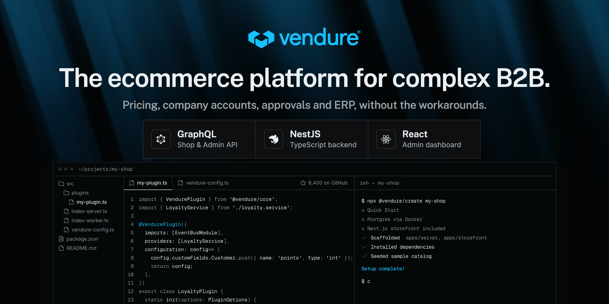

  

<h1 align="center">Vendure</h1>

<strong>The ecommerce platform for complex B2B.</strong>

Pricing, company accounts, approvals and ERP, without the workarounds.

  <a href="https://vendure.io">Website</a> ·
  <a href="https://docs.vendure.io">Documentation</a> ·
  <a href="https://vendure.io/pricing">Pricing</a> ·
  <a href="https://vendure.io/core">Vendure Core</a> ·
  <a href="https://vendure.io/blog">Blog</a> ·
  <a href="https://vendure.io/discord">Discord</a>

This is the home of Vendure: a commerce backend built with TypeScript, NestJS and GraphQL, released under GPLv3 and run in production by teams whose requirements never fitted a suite or a composable stack. The framework, the storefront starters, the plugin scaffold and the community plugins are all here.

## Start here

| Repository | What it is |
| --- | --- |
| [vendure](https://github.com/vendurehq/vendure) | The platform itself: Shop and Admin APIs, admin dashboard, plugin model. Begin with `npx @vendure/create`. |
| [nextjs-starter-vendure](https://github.com/vendurehq/nextjs-starter-vendure) | Official Next.js storefront starter. |
| [tanstack-starter-vendure](https://github.com/vendurehq/tanstack-starter-vendure) | Official TanStack Start storefront starter. |
| [community-plugins](https://github.com/vendurehq/community-plugins) | Plugins built and maintained by the community. |
| [plugin-template](https://github.com/vendurehq/plugin-template) | The scaffold for publishing a plugin of your own. |
| [vendure-demo](https://github.com/vendurehq/vendure-demo) | A dockerised demo server you can run locally before installing anything. |

Storefront starters for Remix, Qwik and Angular, plus deployment examples, are in the [full repository list](https://github.com/orgs/vendurehq/repositories).

## Beyond the open-source core

Vendure Core is free and self-hosted. Four plans, Starter, Growth, Scale and Enterprise, add B2B capability on top of it: company accounts, quotes, account hierarchies, approvals, contract pricing and an audit log. [Vendure Cloud](https://vendure.io/cloud), the managed runtime, is included in every paid plan at no extra cost. It is in design-partner preview now, with general availability planned for Q1 2027.

[What each plan adds](https://vendure.io/pricing) · [How Vendure compares](https://vendure.io/compare) · [Moving from another platform](https://vendure.io/migrate)

## Open source, and staying that way

Nothing has been moved out of Core to make room for a plan, and nothing will be. The paid capabilities are new work built on top. A licence already granted cannot be withdrawn, so the Core you run today stays free to use, fork and self-host whatever we do next. A plugin exception sits on top of GPLv3, which keeps your own plugins and custom code yours to license as you choose.

## Elsewhere

[Getting started guide](https://docs.vendure.io/guides/getting-started/installation/) ·
[Discord](https://vendure.io/discord) ·
[Partners](https://vendure.io/partners) ·
[Professional services](https://vendure.io/services) ·
[Careers](https://vendure.io/careers)
